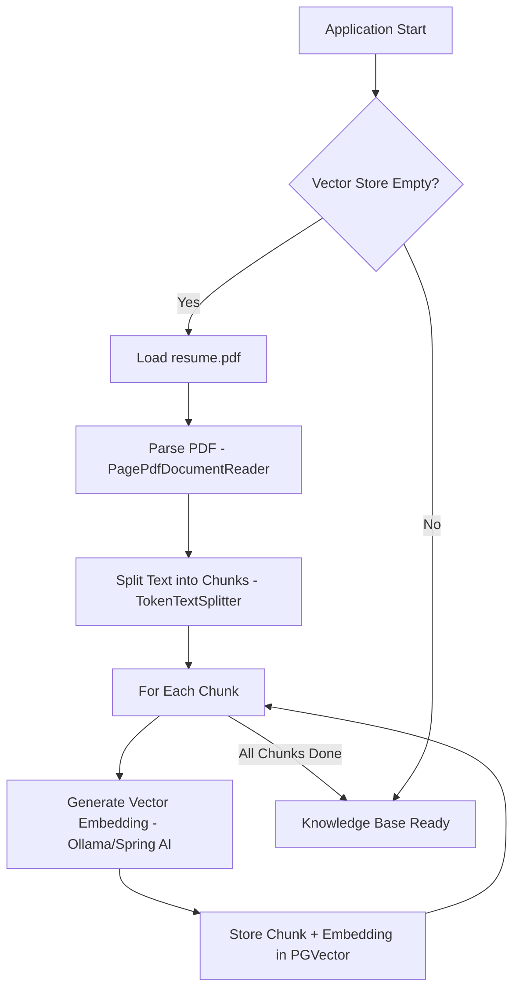
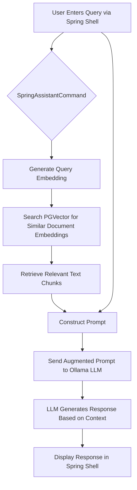

# Building a Smarter Chatbot: Exploring RAGEXAMPLE with Spring AI, Ollama, and PGVector

In the rapidly evolving world of AI, Large Language Models (LLMs) like those accessible through Ollama have demonstrated incredible capabilities in understanding and generating human-like text. However, their knowledge is typically limited to the data they were trained on. What if you need an AI assistant that can answer questions based on *your* specific documents, like internal knowledge bases, technical manuals, or even personal documents like a resume? This is where Retrieval-Augmented Generation (RAG) comes in.

The **RAGEXAMPLE** project serves as a practical demonstration of building such a system using powerful Java ecosystem tools: Spring Boot, Spring AI, Ollama, and the PGVector extension for PostgreSQL. Let's dive into how it works.

## The Challenge: LLMs Need Context

Standard LLMs are powerful but lack access to real-time or private information. Asking one about the specific details in your company's latest unpublished report or the key skills listed on *your* resume will likely yield generic or inaccurate answers. They simply don't have that specific context.

## The Solution: Retrieval-Augmented Generation (RAG)

RAG bridges this gap by combining the retrieval power of vector databases with the generative capabilities of LLMs. It's a sophisticated approach that enhances LLM responses by grounding them in factual, relevant information retrieved from a specific knowledge source. The core steps are:

1.  **Ingest & Vectorize - Building the Knowledge Base:**
    *   **Document Loading & Chunking:** The process starts by loading your source documents (like the `resume.pdf` in this project). Since LLMs have context window limits and work best with focused information, these documents are broken down into smaller, manageable chunks (paragraphs or sections). This is handled by tools like Spring AI's `PagePdfDocumentReader` and `TokenTextSplitter`.
    *   **Vector Embeddings:** Each text chunk is then transformed into a *vector embedding*. Think of an embedding as a list of numbers (a vector) that captures the semantic meaning of the text. Models trained for this purpose represent text with similar meanings using vectors that are close together in a high-dimensional space. Spring AI facilitates generating these embeddings using models like those available via Ollama.
    *   **Storing in a Vector Database:** These vector embeddings, along with their corresponding text chunks, are stored in a specialized *vector database* like PostgreSQL with the PGVector extension. Vector databases are optimized for efficiently searching and retrieving vectors based on similarity.

2.  **Retrieve - Finding Relevant Information:**
    *   **Query Embedding:** When a user submits a query (e.g., "What are the key skills?"), the same embedding model used during ingestion converts this query into a vector embedding.
    *   **Similarity Search:** This query vector is then used to search the vector database. The database calculates the "distance" or "similarity" (often using metrics like cosine similarity or Euclidean distance) between the query vector and the vectors of all the stored document chunks.
    *   **Top-K Retrieval:** The search returns the 'K' document chunks whose vectors are closest (most similar) to the query vector. These are the pieces of information deemed most relevant to answering the user's question. In RAGEXAMPLE, this is done in the `findSimilarDocuments` method, retrieving the top 3 chunks.

3.  **Augment & Generate - Crafting the Response:**
    *   **Prompt Engineering:** This is a crucial step. The retrieved document chunks (the *context*) are combined with the user's original query into a *prompt*. This prompt is carefully structured (using a template like `prompt.st`) to instruct the LLM on how to use the provided information. It might look something like: "Based on the following documents: [Chunk 1 text], [Chunk 2 text], [Chunk 3 text]... Answer the user's question: [User's original query]".
    *   **LLM Generation:** This augmented prompt is sent to the LLM (Ollama in this case via `OllamaChatClient`). The LLM now has both the user's question and relevant factual context from the specific documents.
    *   **Grounded Response:** The LLM generates an answer that is *grounded* in the provided context, leading to a response that is factually consistent with the source documents and directly addresses the user's query within that specific domain.

This RAG process allows the LLM to effectively "consult" the provided documents before answering, overcoming its limitation of only knowing its training data.

## RAGEXAMPLE: A Technical Deep Dive

The RAGEXAMPLE project implements this RAG pattern effectively.

**Core Technologies:**

*   **Framework:** Spring Boot 3.4.4 (Robust Java application framework)
*   **Language:** Java 17
*   **AI Orchestration:** Spring AI 1.0.0-M7 (Simplifies integration with AI models and vector stores)
*   **LLM:** Ollama (Provides access to various open-source LLMs locally)
*   **Vector Store:** PGVector (PostgreSQL extension for efficient vector similarity search)
*   **Document Loading:** Spring AI PDF Document Reader
*   **Database:** PostgreSQL (Managed via Docker Compose)
*   **User Interface:** Spring Shell (For easy command-line interaction)

**Workflow Breakdown:**

Let's visualize the two main phases:

**1. Initialization - Building the Knowledge Base (One-Time Setup)**

This process happens when the application starts and finds the vector store empty. It populates the database with the knowledge from the source document.

*   **Detailed Steps:**
    *   The `ReferenceDocsLoader` component triggers upon application startup (`@PostConstruct`).
    *   It queries the `vector_store` table count in PostgreSQL.
    *   If the count is zero, it proceeds to load `src/main/resources/docs/resume.pdf`.
    *   `PagePdfDocumentReader` handles PDF parsing, potentially configured to handle specific page ranges or formatting.
    *   `TokenTextSplitter` divides the text into chunks, aiming for semantically coherent units suitable for embedding and retrieval. The chunk size is often a configurable parameter.
    *   Spring AI's integration with the configured Ollama embedding model is used to calculate the vector embedding for each text chunk.
    *   Finally, the original text chunk and its calculated vector embedding are inserted as a new record into the `vector_store` table managed by PGVector.

**2. Query Time - Answering User Questions (Runtime)**

This is the RAG pipeline in action whenever a user submits a query via the Spring Shell.

*   **Detailed Steps:**
    *   The Spring Shell captures the user's input via the `q` command, passing the message to the `SpringAssistantCommand.question` method.
    *   The same Ollama embedding model used during initialization converts the user's `message` into a query vector.
    *   The `vectorStore.similaritySearch` method is called, using the query vector to search PGVector. It returns the top `k` (3 in this case) `Document` objects containing the most similar text chunks.
    *   The `prompt.st` template is loaded. A map containing the user's original query (`input`) and the retrieved text chunks (`documents`) is created.
    *   The `PromptTemplate` engine fills the template with these values, creating the final, context-rich prompt.
    *   This `Prompt` object is sent to the `OllamaChatClient`.
    *   The Ollama LLM processes the augmented prompt, generating text that answers the query while referencing the provided document snippets.
    *   The resulting content string is returned and printed to the Spring Shell console.

**Key Code Components:**

*   `pom.xml`: Manages all project dependencies (Spring Boot, Spring AI, Ollama, PGVector, etc.).
*   `compose.yaml`: Defines the Docker service for PostgreSQL with PGVector.
*   `application.yaml`: Configures database connection, Ollama endpoint, and other Spring AI settings.
*   `ReferenceDocsLoader.java`: Handles the one-time setup of reading, chunking, vectorizing, and storing the PDF content.
*   `SpringAssistantCommand.java`: Orchestrates the RAG flow at query time – embedding the query, searching the vector store, building the prompt, calling the LLM, and returning the result via the shell.
*   `OllamaChatController.java`: Includes a basic web endpoint (`/ollama`) that demonstrates direct interaction with Ollama but *doesn't* currently use the RAG pipeline. This could be extended to provide a web-based RAG interface.

## Diving Deeper: Key Concepts

*   **Vector Embeddings:** The heart of semantic search. These numerical representations allow us to mathematically compare the "meaning" of different pieces of text. The quality of the embedding model significantly impacts retrieval relevance.
*   **Similarity Search:** Algorithms (like Cosine Similarity, Euclidean Distance, Dot Product) used by vector databases to find vectors closest to a given query vector in the high-dimensional space. PGVector optimizes these searches within PostgreSQL.
*   **Chunking Strategy:** How documents are split impacts retrieval. Chunks should be large enough to contain meaningful context but small enough to be focused and fit within model limits. Overlapping chunks can sometimes help capture context across boundaries.
*   **Prompt Engineering:** Designing effective prompts is critical for guiding the LLM to use the retrieved context correctly. The prompt needs to clearly instruct the model on its task (e.g., "Answer the question based *only* on the provided documents").

## Why is this Important? Potential Applications

RAGEXAMPLE, while simple, showcases a powerful technique with broad applications:

*   **Customer Support Bots:** Answer questions based on product manuals and FAQs.
*   **Internal Knowledge Systems:** Allow employees to query company policies, reports, and documentation.
*   **Research Assistants:** Help users query and synthesize information from academic papers or technical documents.
*   **Personalized Assistants:** Answer questions based on personal notes, emails, or documents.

## Conclusion

The RAGEXAMPLE project provides a clear and concise blueprint for building context-aware AI applications using Spring AI. By leveraging the RAG pattern with Ollama for generation and PGVector for efficient retrieval, developers can create significantly more useful and accurate AI assistants capable of interacting with specific information domains. This approach moves beyond generic chatbots towards truly knowledgeable AI partners.
